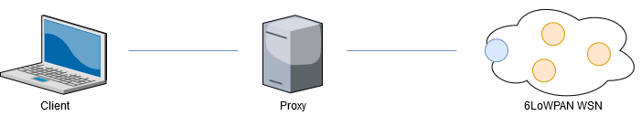

# IoT CoAP Network with 6LoWPAN

An IoT CoAP network 6LoWPAN where CoAP servers communicate with the Border Router for building a DODAG and storing data in a Proxy server. The Proxy server is used as a cache for data gathering from the CoAP network and to manage requests sent from the CoAP client used by the user.

<p align="center">
  
</p>

For more information consults the [documentation](doc/Documentation.pdf).

# Execution
Instructions to execute the project.

First of all, you must start Cooja:

```sh
cd ./contiki/tools/cooja/
ant run
```

In Cooja, you need to put an RPL border router and then 20-30 CoAP servers, like Z1 o Cooja mote.<br>
After, you have to go in RPL border router directory and digit this make commands to start the webserver:

```sh
cd ./c/rpl-border-router/
make connect-router-cooja
```
At this point, you need to open the webserver port on the RPL border router on port 60001 via Cooja.

Now, you should start the Client and the Proxy, so you are going to digit these commands:

```sh
cd ./java/proxy/target/
java -jar proxy.jar z1 30
java -jar client.jar 30
```

Enjoy!

# Contributors

[Antonio Di Tecco](https://github.com/djqwert)<br>
[Simone Pampaloni](https://github.com/spampas)
